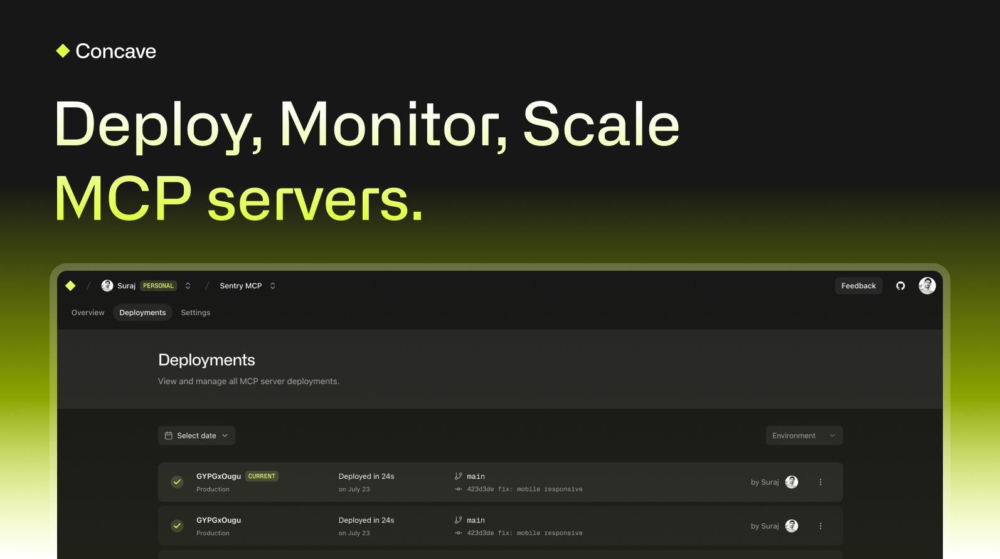

> [!IMPORTANT]
> This project is in **early development** and **actively evolving**. We’re shipping fast and it’s coming soon.

# Concave

**Concave** is a self-hosted platform for deploying, monitoring and scaling MCP servers.

## ✨ Features

- **Git-based Deployments**  
  Push code to GitHub, Concave builds and deploys it automatically.

- **Instant Endpoints**  
  Every deployment gets a public URL you can call from any app or agent.

- **Observability**
  Logs, traces, metrics — all in one dashboard.

- **Secrets Vault**  
  Scoped secrets per deployment with UI and CLI access.

- **Open Source**  
  You can host it, extend it, and modify it freely — no vendor lock-in, no black boxes.

## 🧑‍💻 Contributing

We’re building in public. Jump in, try it out, file issues, or open a PR!  
Star the repo if you want to support the project 🌟

## 📬 Contact

For updates, follow [@concave_dev](https://twitter.com/concave_dev) on Twitter or check out our [website](https://concave.dev).
